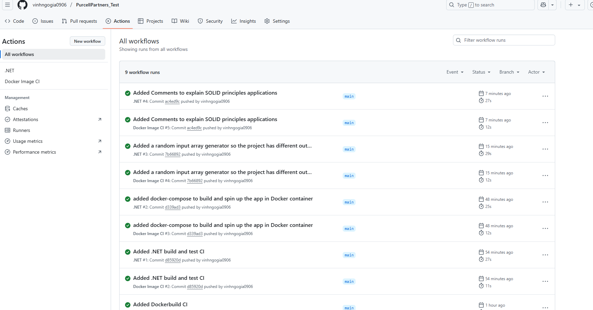
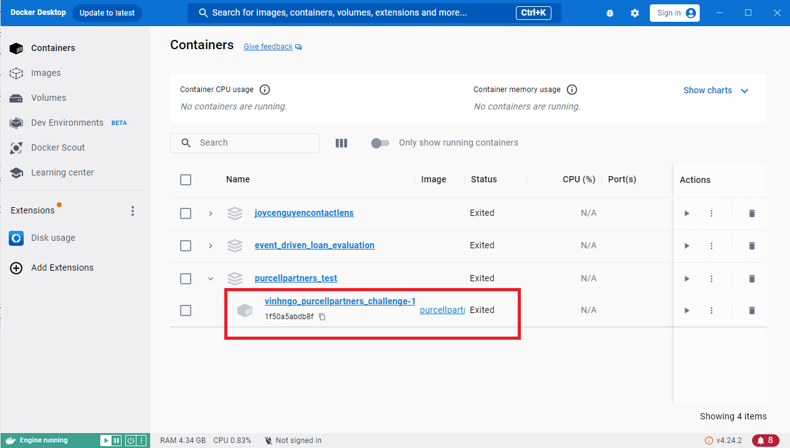
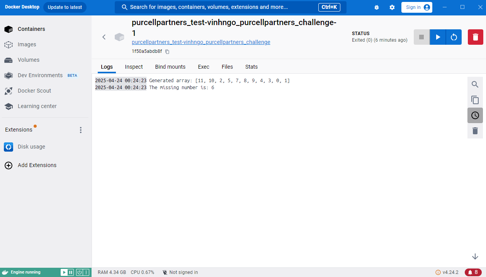
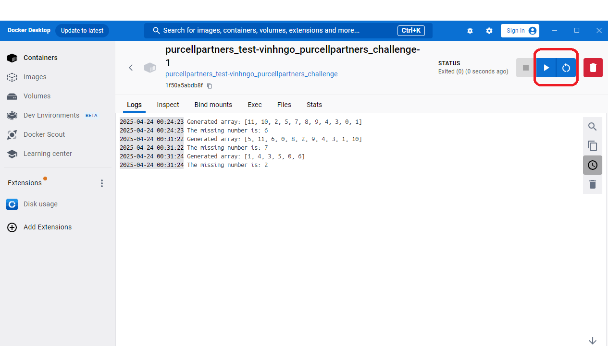

# PurcellPartners_Test
This is [Vinh Ngo](https://github.com/vinhngogia0906) attempt at Purcell Partners's coding test.

It is a console application written in .NET 9.0 to solve the test problem while applies SOLID principles.

## Extra things that I added:
1. Encapsulate the project in a docker container so testers can run it on any machine without having to install .NET 9.0 SDK.
2. An Input Array Generator that creates input array with random lengths so that the project has different result each run.
3. An xUnit Test Project to run Unit tests for the service class.
4. Git Action CI Pipeline that builds docker-container, builds .NET project and runs Unit Test everytime the main branch is pushed.


## Getting Started
This is how you set up and run the project locally in your environment.
1. Download and set up Docker [here](https://docs.docker.com/get-started/get-docker/).
2. Clone the repository
```
git clone https://github.com/vinhngogia0906/PurcellPartners_Test.git
```
3. In the repository, run this command to build and spin up the platform's Docker containers:
```
docker-compose up -d
```
4. Wait for Docker to spinup the container `purcellpartners_test` then click it.

5. The result will be shown in the `Logs` Tab

6. Click the `Run` or `Restart` button to produce more run with different results
